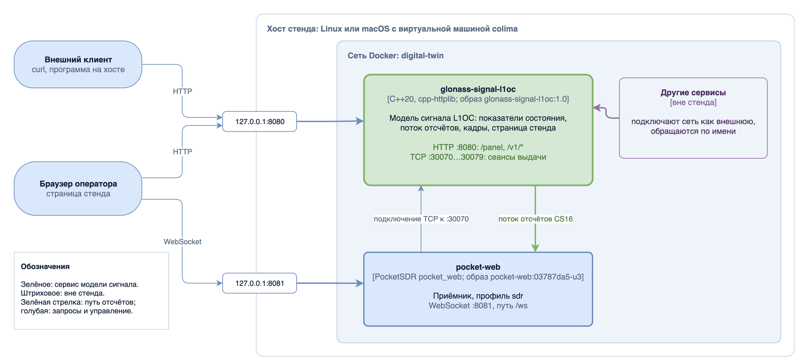
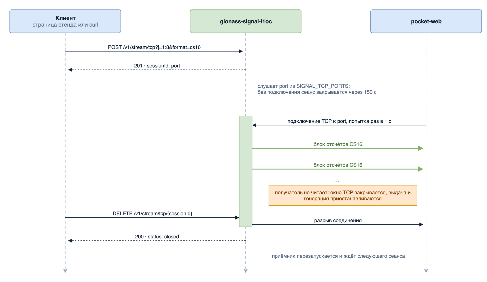

# signal-service-l1oc

Микросервис цифровой модели навигационного сигнала ГЛОНАСС L1OC (БИНК) и стенд «модель сигнала → приёмник» в контейнерах Docker: сервис модели сигнала `glonass-signal-l1oc` и программный приёмник
`pocket-web` на основе PocketSDR.

## 1. Назначение и границы

Сервис формирует отсчёты суммарного сигнала L1OC выбранных НКА и выдаёт:

- поток отсчётов I/Q в теле ответа HTTP либо по отдельному соединению TCP, в формате CS16 или CF32;
- кадры: числовые ряды в JSON и те же кадры изображением SVG (спектральная плотность мощности,
  осциллограмма, гистограмма мгновенных значений, корреляционные функции, строка навигационного
  сообщения);
- показатели состояния модели на заданный момент времени, вычисляемые без прогона модели;
- страницу стенда `/panel`.

Модель описывает только сторону передатчика. Канал распространения (задержка, доплеровский сдвиг, шум,
многолучёвость) не моделируется.

Приёмник `pocket-web` принимает поток сервиса по TCP и отдаёт состояние приёма по WebSocket; эти данные
показывает компоновка «Приёмник» страницы стенда.

Параметры сигнала взяты из ИКД ГЛОНАСС L1OC ред. 1.0 (2016); профиль ИКД сервис сообщает в поле
`icdProfile` точки `/v1/info`. Числовые значения параметров сигнала в этом файле не приводятся:
константы находятся в `include/glonass/types.h`, умолчания параметров запроса в
`apps/common/request_params_l1oc.h`.

Версия сервиса 1.0, версия интерфейса `v1` (`apps/signal_service_l1oc/service_version.h`).



## 2. Состав

| Путь | Содержание |
|---|---|
| `apps/signal_service_l1oc/` | сервис: интерфейс HTTP, потоковая выдача, кадры, страница стенда |
| `apps/common/` | разбор параметров запроса L1OC |
| `apps/iq_convert/` | конвертер записи CF32 → CS16; его примитивы квантования использует сервис |
| `apps/signal_gen/`, `apps/signal_gen_l1oc/` | модули запуска генерации записи I/Q; в образ не входят, нужны конфигурированию CMake |
| `include/glonass/`, `src/` | ядро модели, статическая библиотека `glonass_fdma_core` |
| `third_party/cpp-httplib/` | сервер HTTP, заголовочная библиотека |
| `third_party/PocketSDR/` | часть PocketSDR для сборки `pocket_web`; изменения описаны в `third_party/PocketSDR/README.md` |
| `deploy/compose.yaml` | описание стенда |
| `deploy/signal-service-l1oc/` | Dockerfile образа сервиса `glonass-signal-l1oc:1.0` |
| `deploy/pocket-web/` | Dockerfile образа приёмника `pocket-web:03787da5-u3`, настройки `pocket_web.ini`, проверка работоспособности `healthcheck.sh` |
| `CMakeLists.txt` | сборка без Docker |
| `images/` | рисунки README: PNG со встроенной схемой draw.io, открываются в draw.io для правки |

## 3. Требования

Стенд в контейнерах:

- Docker Engine с плагином compose v2 (команда `docker compose`).
- Процессор x86_64 с расширениями AVX2 и FMA3 либо aarch64 с ARMv8.2 и расширением dotprod: библиотека
  приёмника собирается с флагами `-mavx2 -mfma` или `-march=armv8.2-a+dotprod`
  (`deploy/pocket-web/Dockerfile`, `third_party/PocketSDR/lib/build/libsdr.mk`).
- При сборке образов доступ к Docker Hub (базовый образ `debian:bookworm-slim`) и к `deb.debian.org`
  (пакеты сборки): около 28 МБ базового образа и около 170 МБ пакетов Debian с индексами (замер на
  aarch64). Без такого доступа см. раздел 5.
- На macOS контейнеры работают в виртуальной машине colima:
  `brew install colima docker docker-compose docker-buildx`; в `~/.docker/config.json` указывается
  каталог плагинов `"cliPluginsExtraDirs": ["/opt/homebrew/lib/docker/cli-plugins"]`.

Проверено на macOS (Apple M4): colima 0.10.3, виртуальная машина aarch64 с 8 ЦП и 8 ГБ, Docker Engine 29.5.2,
compose 5.4.0, buildx 0.36.1. Сборка и работа на x86_64 не проверялись.

Сборка без Docker: Linux или macOS, CMake 3.20 или новее, компилятор C++20. Проверено: GCC 12 (в образе
сервиса) и Apple clang 17.

## 4. Запуск стенда

Команды выполняются из корня репозитория.

**Linux.** Поднять сервис и приёмник:

```bash
docker compose -f deploy/compose.yaml --profile sdr up -d
```

Первый запуск собирает образы и требует доступа к сети из раздела 3. Команды `docker` выполняются от
пользователя из группы `docker` либо через `sudo`. Только сервис, без приёмника:

```bash
docker compose -f deploy/compose.yaml up -d
```

**macOS.** Сначала запустить виртуальную машину, дальше те же команды:

```bash
colima start
```

**Проверка.** Состояние контейнеров:

```bash
docker compose -f deploy/compose.yaml --profile sdr ps
```

В колонке STATUS ожидается `healthy`; сразу после запуска `starting`, на проверенной конфигурации
`healthy` устанавливается через несколько секунд. Ответ сервиса:

```bash
curl -s http://127.0.0.1:8080/healthz
```

Норма: `{"status": "ok"}`. Страница стенда: `http://127.0.0.1:8080/panel`, компоновка «Приёмник», кнопка
«Открыть сеанс».

Сеанс без страницы стенда (приёмник подключается сам в течение секунды):

```bash
curl -s -X POST "http://127.0.0.1:8080/v1/stream/tcp?j=1:8&format=cs16"
```

Закрыть сеанс, подставив `sessionId` из ответа:

```bash
curl -s -X DELETE http://127.0.0.1:8080/v1/stream/tcp/s-0001
```

**Останов.** Профиль `sdr` указывается и здесь, иначе приёмник продолжит работать:

```bash
docker compose -f deploy/compose.yaml --profile sdr down
```

На macOS затем `colima stop`.

**Порты.** Порты публикуются только на `127.0.0.1` хоста; номера задаются переменными
`STAND_SIGNAL_PORT` и `STAND_RECEIVER_PORT` (раздел 7). Например, если порт 8081 занят:

```bash
STAND_RECEIVER_PORT=18081 docker compose -f deploy/compose.yaml --profile sdr up -d
```

Новый адрес приёмника один раз вводится на странице стенда в поле «Адрес приёмника». Со своей машины
страница стенда открывается через туннель:

```bash
ssh -L 8080:127.0.0.1:8080 -L 8081:127.0.0.1:8081 пользователь@стенд
```

**После изменения кода** пересобрать изменённые образы и перезапустить:

```bash
docker compose -f deploy/compose.yaml --profile sdr up -d --build
```

## 5. Установка без доступа к Docker Hub и Debian

### Перенос готовых образов

Образы собираются на машине с доступом к сети и с той же архитектурой процессора, что у стенда, и
переносятся файлом.

1. Собрать образы:

   ```bash
   docker compose -f deploy/compose.yaml --profile sdr build
   ```

2. Проверить архитектуру образов (`linux/amd64` для x86_64, `linux/arm64` для aarch64):

   ```bash
   docker image inspect --format '{{.RepoTags}} {{.Os}}/{{.Architecture}}' glonass-signal-l1oc:1.0 pocket-web:03787da5-u3
   ```

3. Сохранить образы в файл (для aarch64 около 31 МБ):

   ```bash
   docker save glonass-signal-l1oc:1.0 pocket-web:03787da5-u3 | gzip > stand-l1oc-images.tar.gz
   ```

4. Перенести на стенд файл образов и копию репозитория.

5. На стенде загрузить образы:

   ```bash
   docker load -i stand-l1oc-images.tar.gz
   ```

6. Поднять стенд без сборки и без обращения к реестру:

   ```bash
   docker compose -f deploy/compose.yaml --profile sdr up -d --no-build --pull never
   ```

Путь проверен на aarch64 (colima): сохранение, удаление образов, загрузка, подъём до `healthy`. Образы
для x86_64 собираются на машине x86_64; сборка под другую архитектуру не проверялась.

### Сборка на стенде через зеркало или прокси

Для сборки образов на самом стенде нужны:

- базовый образ `debian:bookworm-slim`: из Docker Hub, через зеркало Docker Hub (параметр демона
  `registry-mirrors`) либо загруженный заранее командой `docker load`;
- пакеты Debian bookworm: для сборки сервиса `g++`, `cmake`, `ninja-build`; для сборки приёмника `g++`,
  `make`, `libusb-1.0-0-dev`; для работы приёмника `libusb-1.0-0`.

Прокси HTTP передаётся без правки Dockerfile, предопределёнными аргументами сборки:

```bash
docker compose -f deploy/compose.yaml --profile sdr build --build-arg http_proxy=http://прокси:порт --build-arg https_proxy=http://прокси:порт
```

Для локального зеркала Debian потребуется правка источников пакетов в Dockerfile. Сборка через зеркало
или прокси не проверялась.

## 6. Интерфейс HTTP

Адрес сервиса: `http://127.0.0.1:8080` на хосте стенда, `http://glonass-signal-l1oc:8080` из сети
`digital-twin` (раздел 9). Описание составлено по коду `apps/signal_service_l1oc/service.cpp`.

### Точки

| Метод и путь | Назначение | Успешный ответ |
|---|---|---|
| `GET /healthz` | проверка работоспособности | 200, JSON `status` |
| `GET /v1/info` | сведения о сервисе | 200, JSON: `service`, `version`, `api`, `band`, `icdProfile` |
| `GET /panel` | страница стенда | 200, HTML |
| `GET /v1/state` | показатели состояния без прогона модели | 200, JSON |
| `GET /v1/stream` | поток отсчётов в теле ответа | 200, `application/octet-stream`, передача частями |
| `POST /v1/stream/tcp` | открытие сеанса выдачи по TCP | 201, заголовок `Location`, JSON: `sessionId`, `port`, `format`, `blockSamples` |
| `DELETE /v1/stream/tcp/{sessionId}` | закрытие сеанса | 200, JSON: `sessionId`, `status` со значением `closed` |
| `GET /v1/frames/{kind}` | кадр числовыми рядами | 200, JSON |
| `GET /v1/frames/{kind}.svg` | тот же кадр изображением | 200, SVG |

Ответ `/v1/info`:

```json
{"service": "signal-service-l1oc", "version": "1.0", "api": "v1", "band": "L1OC", "icdProfile": "ГЛОНАСС L1OC ред. 1.0 (2016)"}
```

### Параметры запроса

Параметры передаются строкой запроса, в том числе для `POST /v1/stream/tcp`.

| Параметр | Смысл | Точки |
|---|---|---|
| `fs` | частота дискретизации, Гц; целое больше нуля | все точки модели |
| `f0` | опорная частота, Гц; целое; остаточная частота равна f_L1OC − `f0` | все точки модели |
| `n0` | номер начального отсчёта; целое, не меньше нуля | все точки модели |
| `j` | состав НКА: диапазон `a:b` или список `a,b,c`, без повторов | все точки модели |
| `amp` | относительные амплитуды: одно значение на все НКА или список по числу НКА; каждое не меньше нуля, не все нулевые | все точки модели |
| `phi0` | начальные фазы, рад: одно значение на все НКА или список по числу НКА | все точки модели |
| `t` | модельное время от отсчёта `n0`, с | `/v1/state` |
| `n` | число отсчётов, больше нуля | поток, сеанс TCP |
| `seconds` | длительность, с; учитывается, если `n` не задан | поток, сеанс TCP |
| `format` | `cs16` (умолчание) или `cf32` | поток, сеанс TCP |
| `blockSamples` | отсчётов в блоке выдачи, от 1 до 1048576; умолчание 65536 | поток, сеанс TCP |

«Все точки модели»: `/v1/state`, `/v1/stream`, `/v1/stream/tcp`, `/v1/frames/{kind}`. Умолчания `fs`,
`f0`, `j`, `amp`, `phi0` и допустимые системные номера НКА заданы в `apps/common/request_params_l1oc.h`.
Без `n` и `seconds` поток не ограничен. Кадры проверяют `n`, `seconds`, `format` и `blockSamples` так
же, как поток, но длину окна задают сами.

Запрос отклоняется с кодом 422, если:

- все амплитуды нулевые;
- `fs` меньше скорости символов свёрточного кода навигационного сообщения (`requireSymbolRate`);
- для потока, сеанса и кадров остаточная частота вместе с полосой модели не укладывается в половину `fs`
  (`isRepresentable`); точка `/v1/state` в этом случае не отказывает, а возвращает
  `"representable": false`.

### Показатели `/v1/state`

| Поле | Смысл |
|---|---|
| `n` | номер отсчёта `n0 + round(t·fs)` |
| `t` | модельное время из запроса, с |
| `band` | диапазон, `L1OC` |
| `satelliteCount` | число НКА в `j` |
| `normalizationFactor` | коэффициент нормировки суммарного сигнала |
| `modelBandwidthHz` | полоса модели, Гц |
| `residualFreqHz` | остаточная частота, Гц |
| `representable` | выполняется ли условие представимости |
| `message.lineIndex` | номер строки навигационного сообщения |
| `message.lineType` | тип строки: `normal`, `anomalous1`, `anomalous2`; в текущей версии всегда `normal` |
| `message.convSymbolIndex` | номер символа свёрточного кода в строке |
| `message.lineLength` | длина строки в символах свёрточного кода |

### Кадры

| `kind` | Кадр |
|---|---|
| `psd` | спектральная плотность мощности суммарного сигнала |
| `waveform` | осциллограмма квадратур I и Q в чиповом масштабе |
| `level` | гистограмма мгновенных значений суммарного сигнала |
| `acf` | периодическая автокорреляционная функция дальномерного кода |
| `ccf` | огибающая периодической взаимнокорреляционной функции ансамбля |
| `navline` | строка навигационного сообщения: символы свёрточного кода |

Ответ JSON содержит `kind`, `title`, `signal` (параметры запроса), раздел оценки (`estimate` у `psd`,
`window` у `waveform`, `metrics` у `level`, `correlation` у `acf`, `ensemble` у `ccf`, `line` у
`navline`), `render` (оси и подписи) и `series` (ряды). Неизвестный `kind` даёт 404.

### Форматы отсчётов

- `cs16`: int16 I, int16 Q, порядок байтов little-endian, чередование. Масштаб квантования вычисляется
  один раз на прогон по аналитической границе отсчёта (`quantizationScaleCs16`,
  `apps/signal_service_l1oc/stream_session.cpp`).
- `cf32`: float32 I, float32 Q, little-endian, чередование; нормированные отсчёты.

### Поток `GET /v1/stream`

Отсчёты передаются частями, блоками по `blockSamples`; последний блок может быть короче. Темп задаёт
получатель: пока он не читает, генерация приостанавливается. Если получатель не читает дольше 150 с,
соединение закрывается.

### Сеанс по TCP



1. `POST /v1/stream/tcp` с параметрами открывает на сервисе слушающий порт из диапазона
   `SIGNAL_TCP_PORTS` и сразу отвечает: `sessionId` (вида `s-0001`), `port`, `format`, `blockSamples`,
   заголовок `Location: /v1/stream/tcp/{sessionId}`.
2. Получатель подключается к этому порту (из сети стенда `glonass-signal-l1oc:<port>`). Принимается одно
   подключение; если подключения нет 150 с, сеанс закрывается сам.
3. Выдача идёт до исчерпания `n` или `seconds`, до разрыва соединения получателем либо до закрытия
   сеанса.
4. `DELETE /v1/stream/tcp/{sessionId}` обрывает выдачу и отвечает сразу; сеанс, который не открывался,
   уже закрыт или завершился, даёт 404.

Ответ на `POST /v1/stream/tcp?j=1:8&format=cs16`:

```json
{"sessionId": "s-0001", "port": 30070, "format": "cs16", "blockSamples": 65536}
```

Предел `SIGNAL_MAX_STREAMS` общий для `GET /v1/stream` и сеансов TCP: сверх предела ответ 503. Порты
сеансов за пределы сети стенда не публикуются.

### Ошибки

Тело ответа: `{"error": "<код>", "field": "<параметр>", "message": "<пояснение>"}`; поле `field`
выводится, только если ошибка относится к параметру запроса.

| Код | `error` | Условие |
|---|---|---|
| 400 | `bad_request` | параметр не разбирается либо вне допустимого диапазона |
| 404 | `not_found` | неизвестный путь, кадр или сеанс |
| 422 | `unprocessable` | значения корректны, но конфигурация нереализуема |
| 500 | `internal` | внутренняя ошибка |
| 503 | `unavailable` | исчерпан предел потоков, нет свободного порта сеанса либо сервис завершает работу |

### Страница стенда

`GET /panel` отдаёт страницу с компоновками «Обзор», «Разбор», «Сравнение» и «Приёмник»; страница
обращается к точкам `/v1` того же адреса. Компоновка «Приёмник» подключается из браузера к WebSocket
приёмника по адресу из поля «Адрес приёмника»: по умолчанию хост страницы и порт 8081; введённый адрес
браузер запоминает.

## 7. Переменные окружения

Сервис (значения по умолчанию заданы в коде и в образе):

| Переменная | Умолчание | Назначение |
|---|---|---|
| `SIGNAL_PORT` | `8080` | порт HTTP |
| `SIGNAL_MAX_STREAMS` | `1` | предел одновременно открытых потоков, `GET /v1/stream` и сеансов TCP вместе |
| `SIGNAL_TCP_PORTS` | `30070-30079` | диапазон портов сеансов TCP, границы включительно |
| `SIGNAL_MAX_JOBS` | `1` | разбирается и выводится в журнал при запуске; на работу не влияет |
| `SIGNAL_WORK_DIR` | `/tmp/signal` | разбирается и выводится в журнал при запуске; на работу не влияет |

Недопустимое значение (не целое число, порт вне 1…65535, предел меньше 1, пустой каталог, начало
диапазона больше конца) останавливает запуск с кодом 1 (`apps/signal_service_l1oc/service_config.h`).
В `deploy/compose.yaml` переменные сервиса не переопределяются. Приёмник подключается к порту 30070
(`deploy/pocket-web/pocket_web.ini`), который при `SIGNAL_MAX_STREAMS=1` всегда достаётся сеансу;
при изменении диапазона или предела настройку приёмника нужно согласовать.

Стенд:

| Переменная | Умолчание | Назначение |
|---|---|---|
| `STAND_SIGNAL_PORT` | `8080` | порт сервиса на `127.0.0.1` хоста |
| `STAND_RECEIVER_PORT` | `8081` | порт приёмника на `127.0.0.1` хоста |

Переменные стенда задаются в окружении или в файле `deploy/.env`; внутри контейнеров порты не меняются.

## 8. Приёмник pocket-web

- Приложение `pocket_web` из PocketSDR 0.20 (коммит `03787da5`) с изменениями У2 и У3
  (`third_party/PocketSDR/README.md`): режим «только наблюдение», перезапуск приёмника по окончании
  входного потока, переподключение входа через 1 с, масштаб перевода CS16 в int8 по первому блоку.
- В образе запускается как
  `pocket_web -web 0.0.0.0:8081 -html /usr/share/pocket-web/html -ini /etc/pocket-web/pocket_web.ini -start`.
  Каталог `-html` пуст: корень отвечает 404, интерфейс PocketSDR не отдаётся.
- Вход: клиент TCP к `glonass-signal-l1oc:30070`. Формат, частота дискретизации, частота сигнала, набор
  сигналов и НКА заданы в `deploy/pocket-web/pocket_web.ini`. Файл настроек только для чтения, рабочий
  каталог закрыт на запись: навигационные данные между сеансами не сохраняются.
- WebSocket `ws://<хост>:8081/ws`, протокол PocketSDR версии 1. Клиенту доступны команды JSON `sub`,
  `unsub`, `get` (с полем `topic`) и `sel_ch`; остальные отклоняются ответом `not supported`. Темы:
  `rcv_stat`, `ch_stat`, `sat_stat`, `pvt_sol`, `rfch_stat`, `hist`, `log`, `array_stat`, `opts`, `cfg`
  и двоичные `psd`, `corr`, `corr_hist`. Сервер отправляет ping раз в 10 с и отключает клиента, от
  которого 30 с ничего не приходило. Сообщения описаны в исходнике `third_party/PocketSDR/src/sdr_web.c`.
- Проверка работоспособности: рукопожатие WebSocket на `/ws` и признак `"run":1` в приветствии
  (`deploy/pocket-web/healthcheck.sh`).
- После окончания потока приёмник перезапускается и ждёт следующего сеанса; отсчёт времени начинается
  заново.

## 9. Сеть digital-twin

Оба контейнера подключены к сети Docker с постоянным именем `digital-twin`. Внутри неё доступны:

- `glonass-signal-l1oc:8080`: интерфейс HTTP сервиса;
- `glonass-signal-l1oc:30070`…`30079`: порты сеансов TCP;
- `pocket-web:8081`: WebSocket приёмника.

Другой стенд подключается к этой сети как к внешней (`external: true`, `name: digital-twin`) и
обращается к сервису по имени. Порты, опубликованные на `127.0.0.1` хоста, из контейнеров недоступны.
Сеть можно создать заранее, не зависящей от порядка запуска стендов командой:

```bash
docker network inspect digital-twin >/dev/null 2>&1 || docker network create digital-twin
```

В этом случае `up` стенда предупреждает, что сеть создана не compose, и продолжает работу; `down` такую
сеть не удаляет. Если сети нет, стенд создаёт её сам.

## 10. Сборка без Docker

```bash
cmake -S . -B build -DCMAKE_BUILD_TYPE=Release -DGLONASS_BUILD_TESTS=OFF
```

```bash
cmake --build build --target glonass_signal_service_l1oc
```

```bash
./build/apps/glonass_signal_service_l1oc
```

- Ключ `-DGLONASS_BUILD_TESTS=OFF` отключает модульные тесты; без него конфигурирование требует
  каталога `tests/`.
- Сервис занимает порт `SIGNAL_PORT` на всех интерфейсах; останавливается по SIGINT или SIGTERM.
- `--healthcheck`: проба собственной точки `/healthz`, код возврата 0 означает норму; `--help`: краткая
  справка.
- Журнал выводится в стандартный вывод строками: время UTC, уровень, номер запроса, сообщение.
- Приёмник собирается только в образе; порядок сборки в `deploy/pocket-web/Dockerfile`.

## 11. Известные особенности

- Одновременно выдаётся один поток: при `SIGNAL_MAX_STREAMS=1` второй `GET /v1/stream` или
  `POST /v1/stream/tcp` получает 503, пока первый не закрыт.
- `down` без `--profile sdr` не останавливает `pocket-web`: повторить команду с профилем.
- На macOS занятый порт хоста colima не сообщает: контейнер поднимается, а на `127.0.0.1` отвечает
  другая программа. Проверить `lsof -nP -iTCP:8080 -sTCP:LISTEN` и поднять стенд с `STAND_SIGNAL_PORT`
  или `STAND_RECEIVER_PORT`.
- Генерация отсчётов однопоточная и на проверенной машине идёт медленнее реального времени; темп потока
  задаёт управление потоком TCP. Кадры и показатели от этого не зависят.
- При `f0`, отличной от несущей L1OC, модель сдвигает только несущую: доплеровский сдвиг кода не
  моделируется, петля задержки приёмника накапливает статическую ошибку, и при больших отстройках
  сопровождение срывается.
- Адрес приёмника, введённый на странице стенда, хранится в браузере и умолчанию не уступает: при смене
  порта его нужно ввести заново.

## 12. Сторонние компоненты

| Компонент | Версия | Лицензия | Файл лицензии |
|---|---|---|---|
| cpp-httplib | v0.53.1 | MIT | `third_party/cpp-httplib/LICENSE` |
| PocketSDR | 0.20, коммит `03787da5` | BSD 2-clause | `third_party/PocketSDR/LICENSE.txt` |
| RTKLIB, ветвь для PocketSDR | 2.4.3 b34 | BSD 2-clause | `third_party/PocketSDR/lib/RTKLIB/readme.txt` |
| PocketFFT | в составе PocketSDR | BSD 3-clause | `third_party/PocketSDR/lib/pocketfft/LICENSE.md` |
| Базовый образ `debian:bookworm-slim` | bookworm | лицензии пакетов Debian | в образе |
